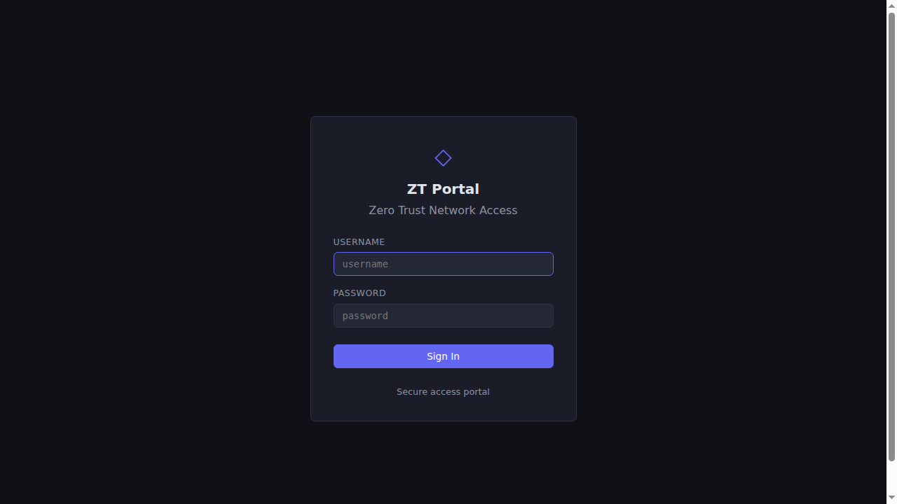
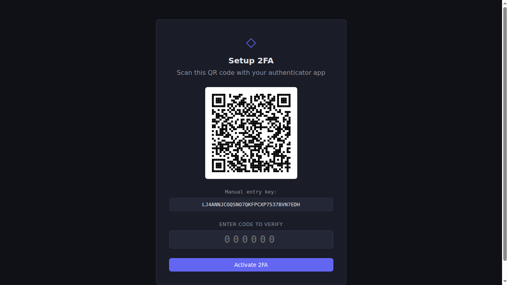
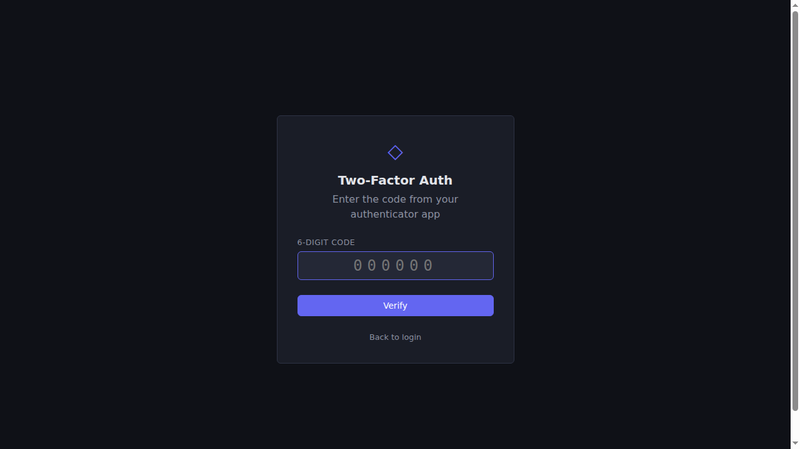
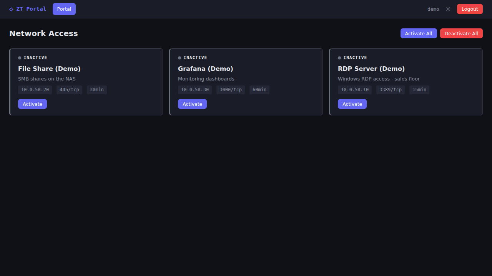
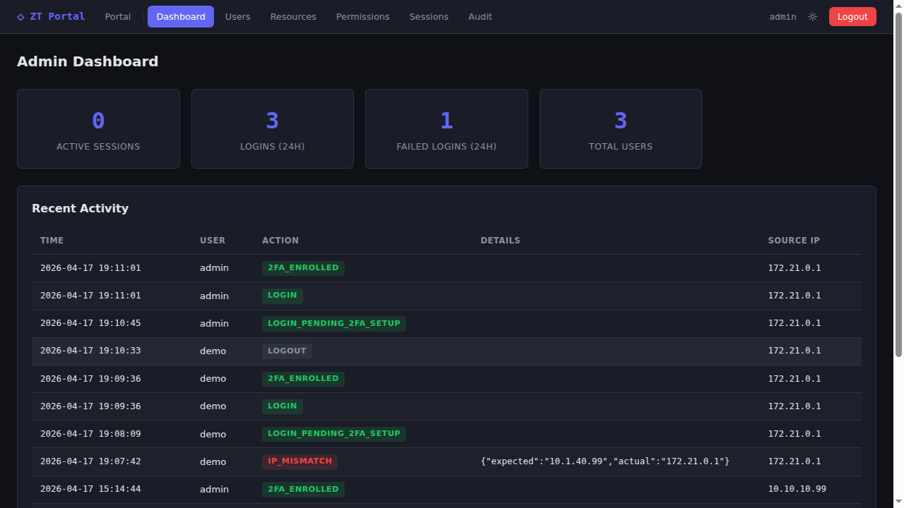
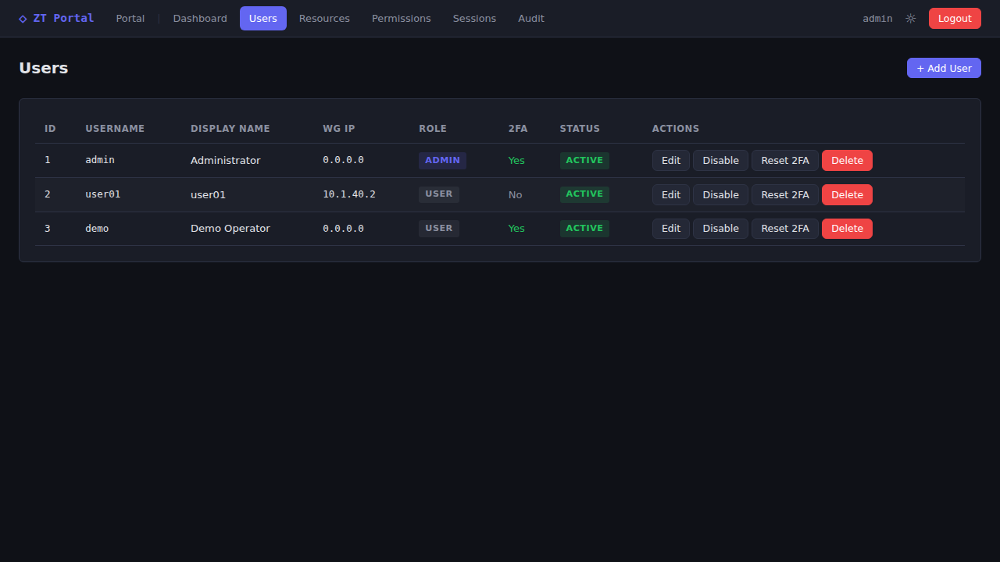
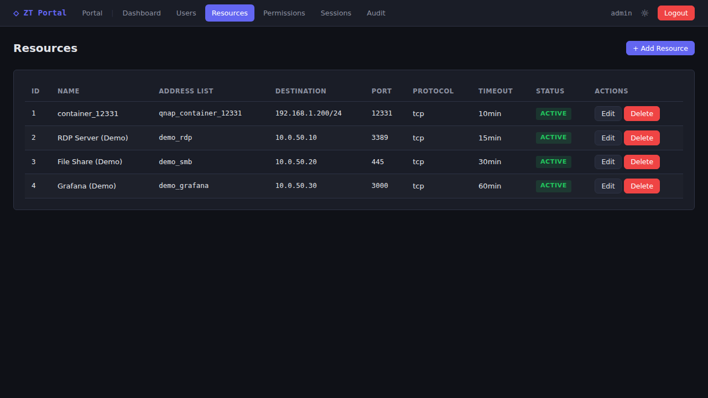
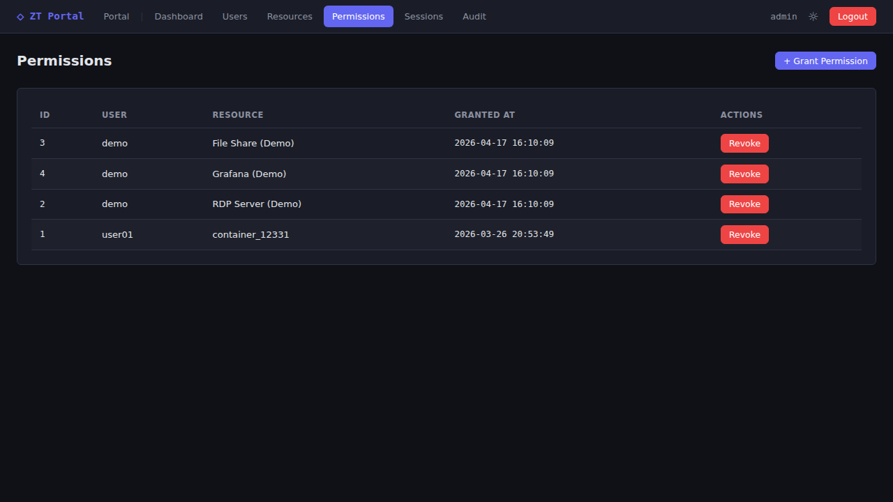
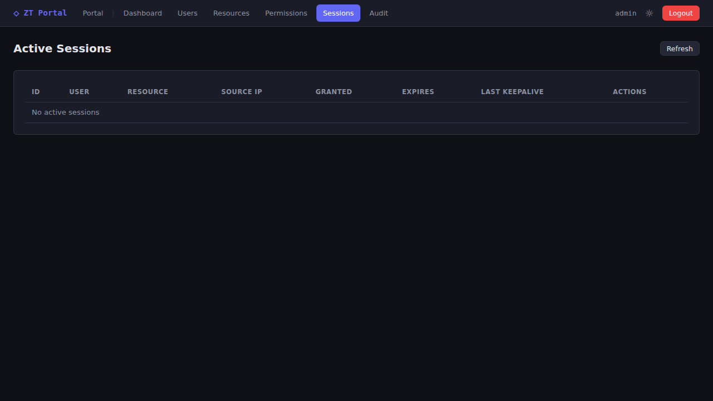
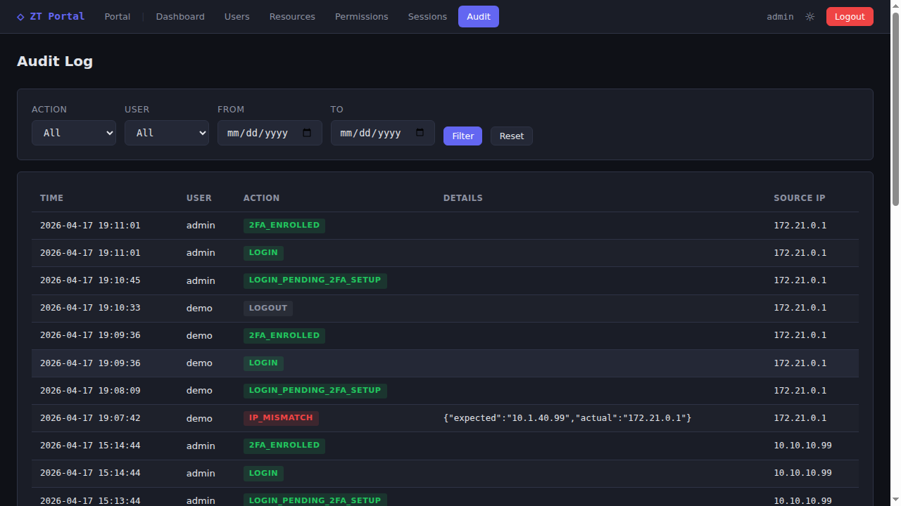

# ZT Portal — Οδηγός Χρήσης

Πρακτικός οδηγός για καθημερινή χρήση του Zero Trust Portal — για τελικούς χρήστες, διαχειριστές, και για όποιον θέλει να δει **πώς είναι στην πράξη** πριν το στήσει.

> **Tip**: Για τεχνικές λεπτομέρειες δες [`PROJECT_SPECS.md`](PROJECT_SPECS.md). Για εγκατάσταση σε QNAP δες [`QNAP_SETUP.md`](QNAP_SETUP.md).

---

## Γρήγορη επισκόπηση

Ο χρήστης:
1. Συνδέεται στο WireGuard VPN (παίρνει σταθερό IP, π.χ. `10.1.40.10`)
2. Ανοίγει το portal (`https://<portal>:7443`)
3. Κάνει login με κωδικό + 2FA
4. Πατά **Activate** σε ένα resource (RDP, SMB, SSH...)
5. Το MikroTik ανοίγει το firewall για τον χρήστη για X λεπτά
6. Όταν τελειώσει → logout ή αναμονή για timeout → firewall κλείνει ξανά

---

## Για τον τελικό χρήστη

### Βήμα 1 — Σύνδεση στο WireGuard

Πριν μπεις στο portal πρέπει να είσαι ήδη συνδεδεμένος στο εταιρικό WireGuard. Ο admin σού έχει δώσει ένα αρχείο `.conf` ή QR code.


### Βήμα 2 — Login

Άνοιξε browser στο `https://<portal-ip>:7443`. Θα δεις το login screen:



**Αν είναι η πρώτη σου σύνδεση**, μετά τον κωδικό θα σου ζητηθεί setup του 2FA:



Σκάναρε το QR με Google Authenticator / Authy / FreeOTP και πληκτρολόγησε τον 6ψήφιο κωδικό.

### Βήμα 3 — 2FA

Σε κάθε επόμενη σύνδεση θα σου ζητείται μόνο ο TOTP κωδικός:



### Βήμα 4 — Portal (ενεργοποίηση πόρων)

Μετά το login βλέπεις τη λίστα με τους πόρους στους οποίους έχεις πρόσβαση:



- **Active** (πράσινο): έχεις ενεργή πρόσβαση — ο countdown δείχνει πόσα λεπτά μένουν
- **Inactive** (γκρι): πάτα **Activate** για να ανοίξει το firewall
- **Expiring** (πορτοκαλί): λιγότερα από 2 λεπτά πριν λήξει — μπορείς να το ανανεώσεις

Όταν είσαι ενεργός σε κάποιο resource, το tab μένει ανοιχτό και στέλνει keepalive κάθε λεπτό. Αν κλείσεις το tab, μετά το timeout η πρόσβαση λήγει αυτόματα.

### Βήμα 5 — Logout

Πάτα **Logout** πάνω δεξιά — όλες οι ενεργές προσβάσεις αφαιρούνται αμέσως.

---

## Για τον διαχειριστή (admin)

Μπαίνεις σαν `admin` και παίρνεις ένα ξεχωριστό admin panel.

### Admin Dashboard



Δείχνει συνοπτικά: ενεργές συνεδρίες, online users, πρόσφατα alerts.

### Διαχείριση Χρηστών

`Admin → Users`



Από εδώ:
- Προσθήκη/αφαίρεση χρήστη
- Ορισμός ρόλου (user / admin)
- Reset κωδικού
- Reset 2FA (αν ο χρήστης έχασε το τηλέφωνο)
- Enable / disable λογαριασμού
- Ορισμός WireGuard IP (σταθερό ανά χρήστη)

### Διαχείριση Πόρων

`Admin → Resources`



Ένας **πόρος** είναι ένας στόχος στο δίκτυο (π.χ. "RDP Server"). Περιλαμβάνει:
- **Name** — εμφανιζόμενο όνομα
- **Address-list name** — το `auth_xxx` που πρέπει να υπάρχει στο MikroTik
- **Destination** — IP/subnet + port + protocol
- **Timeout** — πόσα λεπτά μένει ανοιχτό

Η εφαρμογή **δεν δημιουργεί firewall rules** στο MikroTik. Πρέπει να υπάρχουν ήδη χειροκίνητα — η εφαρμογή απλώς προσθέτει/αφαιρεί entries σε address-lists.

### Permissions

`Admin → Permissions`



Matrix: ποιος χρήστης βλέπει ποιο resource. Ο admin βλέπει τα πάντα by default.

### Active Sessions

`Admin → Sessions`



Ζωντανή εικόνα ποιος έχει τώρα ενεργή πρόσβαση και σε ποιο resource. Ο admin μπορεί να **force-revoke** οποιαδήποτε session.

### Audit Log

`Admin → Audit`



Πλήρες log:
- Login attempts (success/fail)
- 2FA verifications
- Resource activations/revocations
- Keepalives
- Admin actions (add/remove user κλπ)

Filters: per-user, per-resource, per-action, date range.

---

## Demo / Δοκιμαστικός λογαριασμός

Για demos και screenshots υπάρχει script που φτιάχνει λογαριασμό με ελάχιστες απαιτήσεις:

```bash
./scripts/create-demo-user.sh
```

Φτιάχνει χρήστη:
- **Username**: `demo`
- **Password**: `demo1234`
- **Role**: user
- **WireGuard IP**: `0.0.0.0` (IP-check bypass — μπορεί να κάνει login από οπουδήποτε)

> **Σημείωση**: Η εφαρμογή επιβάλλει αρχιτεκτονικά 2FA enrollment στο πρώτο login.
> Δεν γίνεται τέλειος bypass — ο demo χρήστης θα κάνει setup 2FA την πρώτη φορά σαν κανονικός.
> Για demos αρκεί να κρατήσεις το secret και να παράγεις κωδικούς από CLI ή app.

⚠️ **ΠΟΤΕ σε production** — μόνο για screenshots και παρουσιάσεις.

Για να τον διαγράψεις μετά:
```bash
./scripts/create-demo-user.sh --delete
```

---

## Troubleshooting

### "Cannot reach MikroTik API"
- Admin → Settings → Test Connection
- Έλεγξε ότι ο container μπορεί να δει το router (routing, firewall)
- Τσέκαρε ότι ο API user έχει `rest-api,write` policy

### Χρήστης χάνει σύνδεση κάθε 10 λεπτά
- Το JS keepalive τρέχει μέσα στο tab — αν χρησιμοποιεί άλλο browser/tab, δεν ανανεώνεται
- Λύση: πες του να αφήσει το portal tab ανοιχτό

### Ο admin κλειδώθηκε έξω (έχασε 2FA)
```bash
# Reset 2FA του admin από CLI
docker exec zt-portal-db mysql -uztportal -p"$DB_PASS" zt_portal -e \
  "UPDATE users SET totp_enabled=0, totp_secret=NULL WHERE username='admin';"
```

### Reset κωδικού admin
Δες [`QNAP_SETUP.md`](QNAP_SETUP.md#reset-admin-password) για τη διαδικασία.

---

## Συμβατότητα browsers

Τεστάρεται σε: Chrome/Edge 120+, Firefox 120+, Safari 17+.

Απαιτείται JavaScript enabled (για keepalive + real-time countdown).

---

## Screenshots directory

Όλα τα PNGs βρίσκονται στο `docs/screenshots/` και δημιουργήθηκαν αυτόματα με browser automation.

Για re-capture μετά από UI αλλαγές:
1. `./scripts/create-demo-user.sh` — δημιουργία demo user
2. Login → setup 2FA (κράτα το secret από την κονσόλα)
3. Browser automation ή screenshot tool για τις σελίδες του portal
